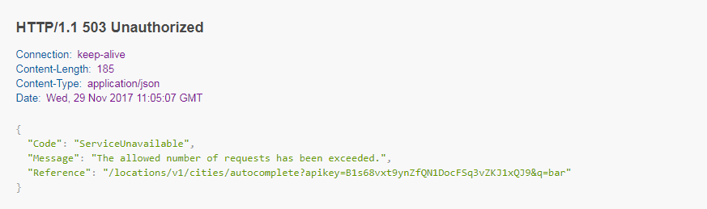
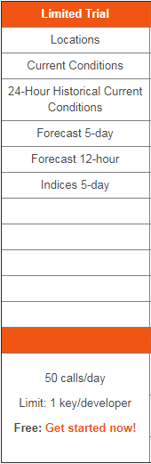

# Sunny

NLP aproach app

### To install

```
> npm install

```
### To run

To run the backend

```
> npm run server
```
To run the UI (in a new terminal)

```
> npm start
```
### To see it

open a **browser** on ```localhost:8080```

## Misc

Insted of using any pre-set of hardocded location keys or any arbitrary values my aproach to resolve this exercise is get a list cities using the endpoint _Top cities list_ of the _Locations API_ so I call ```http://dataservice.accuweather.com/locations/v1/topcities/50``` so 50 is the minimun lenght allowed in my new array of cities provided, My intention is using the key of every city to make a call to the _Forecast API_ to ge the Dayly or hourly forecast and store all this values pushed into a new array of weather info of cities.

Planing dispatch an event from UI wich action will use the words to sort in my array of weahet info using the weather text desciption to filter this cities and show them. 

I start to build the API creating a middleware to get the list of location keys and create the logic in my endpoint to get the forecast for all of them looping the array of cities but then I had a problem:



Accuweather do not allow severals call to his **free** API



So I have to move on using another resources like try to get a mock of accuweather json and inject it directly, use another weather API, or use the example enpoints of documentation